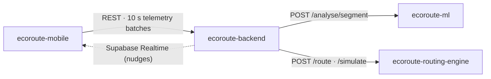

# EcoRoute Backend

**The REST API and orchestration layer for EcoRoute, a carbon-aware driving app that plans lower-energy routes, coaches drivers in real time, and calculates the CO₂ of every trip from smartphone GPS alone.**

Part of **EcoRoute**, our Final Year Project at Monash University Malaysia (2026):

| Repo | Role |
|---|---|
| [ecoroute-mobile](https://github.com/bentez7/ecoroute-mobile) | iOS/Android app: route planning, navigation, live coaching, trip history |
| **ecoroute-backend** (this repo) | REST API, auth, database, orchestration (Node.js · Express · Supabase) |
| [ecoroute-ml](https://github.com/bentez7/ecoroute-ml) | Driving-behaviour classifier with explainable feedback (XGBoost · SHAP · FastAPI) |
| [ecoroute-routing-engine](https://github.com/bentez7/ecoroute-routing-engine) | Energy-aware routing and trip energy simulation (NREL RouteE Compass · FASTSim) |

## What this service does

- **Auth and data:** Supabase Auth plus PostgreSQL with row-level security on every table (users, vehicles, trips, raw telemetry, 10-second behaviour segments, coaching events, route comparisons).
- **Route planning:** calls the routing engine for *fastest / lowest-energy / balanced* routes, then snaps them to Mapbox via Map Matching (with a Directions fallback) so the app can run turn-by-turn navigation.
- **Live coaching pipeline:** receives 10-second telemetry batches from the phone, sends them to the ML service, stores the labelled segments, and inserts coaching events that reach the phone over **Supabase Realtime** in about a second.
- **Post-trip analysis:** returns immediately when a trip ends, then asynchronously runs FASTSim on the recorded GPS trace, converts the energy to CO₂, compares it to the eco route, and updates the user's lifetime footprint through a race-free `SECURITY DEFINER` RPC.
- **Docs and tests:** Swagger UI at `/api-docs`, Jest tests for controllers, middleware and emission helpers, and 13 versioned SQL migrations.



**Team:** Teng Kong Cheng, Wong Wei Jian, Benjamin Tan En Zhe. Teng Kong Cheng built most of this service. My own work (Benjamin) was mainly on the [mobile app](https://github.com/bentez7/ecoroute-mobile); here I added the Mapbox Directions fallback and speed-band energy estimate in `RoutingService.helper.js`.

---

## Tech Stack

| Layer | Technology |
|---|---|
| Runtime | Node.js |
| Framework | Express.js |
| Language | JavaScript (CommonJS) |
| Database | Supabase (PostgreSQL 15) |
| Auth | Supabase Auth |
| Realtime | Supabase Realtime |
| Maps | Mapbox Map Matching / Directions, Google Places |
| Testing | Jest, Swagger UI |
| Path aliases | module-alias |

---

## Project Structure

```
app/
├── config/          # App config, keys, Supabase connection config
├── database/        # Supabase client singletons (anon + service role) + models
├── controllers/     # Thin request handlers — delegate to services
├── services/        # Business logic and database operations per resource
├── routes/          # Express routers with middleware guards
├── middleware/       # Auth JWT, service role, error handler, validation
├── helpers/         # Routing, ML, Mapbox, Places clients; CO2 emission factors
└── utils/           # Winston logger
supabase/
└── migrations/      # SQL schema, RLS policies, indexes, triggers
samples/
└── .env.sample      # Environment variable template
server.js            # Entry point
```

---

## Database Schema

| Table | Written by | Purpose |
|---|---|---|
| `users` | Auth trigger | User profiles — extends Supabase auth.users |
| `vehicles` | Mobile app | User-owned vehicles with FASTSim parameters |
| `trips` | Mobile app + post-trip pipeline | One row per trip; energy, CO₂ and driver profile filled in asynchronously |
| `raw_telemetry` | Mobile app | 1 Hz GPS stream, pruned after 30 days |
| `telemetry_segments` | Backend (from ML service) | 10-second behavioural windows with XGBoost label, confidence, SHAP top feature, polyline |
| `route_comparisons` | Post-trip pipeline | Actual trip vs. eco/fastest alternatives |
| `feedback_events` | Backend (auto) | Coaching nudges, published to the app over Supabase Realtime |

---

## API Endpoints

### Auth
| Method | Path | Auth | Description |
|---|---|---|---|
| POST | `/api/auth/signup` | — | Register with email + password |
| POST | `/api/auth/signin` | — | Sign in, returns session tokens |
| POST | `/api/auth/signout` | JWT | Revoke session |
| GET | `/api/auth/me` | JWT | Get current user profile |

### Vehicles
| Method | Path | Auth | Description |
|---|---|---|---|
| POST | `/api/vehicles` | JWT | Add a vehicle |
| GET | `/api/vehicles` | JWT | List user's vehicles |
| PATCH | `/api/vehicles/:id` | JWT | Update vehicle |
| DELETE | `/api/vehicles/:id` | JWT | Delete vehicle |

### Trips
| Method | Path | Auth | Description |
|---|---|---|---|
| POST | `/api/trips` | JWT | Create a trip |
| GET | `/api/trips` | JWT | List user's trips |
| GET | `/api/trips/:id` | JWT | Get a trip |
| GET | `/api/trips/stats` | JWT | Lifetime stats (trips, distance, CO₂) |
| PATCH | `/api/trips/:id` | JWT | Update a trip |
| PATCH | `/api/trips/:id/end` | JWT | End a trip and start the post-trip pipeline |
| PATCH | `/api/trips/:id/cancel` | JWT | Cancel a trip |

### Telemetry
| Method | Path | Auth | Description |
|---|---|---|---|
| POST | `/api/telemetry` | JWT | Bulk insert raw telemetry points |
| GET | `/api/telemetry/trip/:tripId` | JWT | Get telemetry for a trip |

### Places & Routes
| Method | Path | Auth | Description |
|---|---|---|---|
| POST | `/api/places/autocomplete` | JWT | Place autocomplete |
| POST | `/api/places/search` | JWT | Place search |
| GET | `/api/places/reverse-geocode` | JWT | Coordinates → address |
| POST | `/api/routes/search` | JWT | Fastest / lowest-energy / balanced route alternatives |

### Segments, Route comparisons, Feedback
| Method | Path | Auth | Description |
|---|---|---|---|
| GET | `/api/segments/trip/:tripId` | JWT | Get segments for a trip |
| GET | `/api/segments/:id` | JWT | Get a segment |
| GET | `/api/routes/trip/:tripId` | JWT | Get route comparisons for a trip |
| GET | `/api/feedback/trip/:tripId` | JWT | Get feedback events for a trip |
| PATCH | `/api/feedback/:id/acknowledge` | JWT | Acknowledge a feedback nudge |

### Health
| Method | Path | Description |
|---|---|---|
| GET | `/health` | Server health check |

---

## API Documentation (Swagger UI)

The interactive API documentation is served via Swagger UI. Once the server is running, open:

```
http://localhost:3000/api-docs
```

You can browse all endpoints, view request/response schemas, and test the API directly from the browser.

### How to authenticate in Swagger UI

Most endpoints require a Supabase JWT. To test them:

1. Call `POST /api/auth/signin` in Swagger UI (no auth required) and copy the `access_token` from the response
2. Click the **Authorize** button at the top of the Swagger page
3. Paste the token into the **bearerAuth** field (do not include the word "Bearer" — Swagger adds it automatically)
4. Click **Authorize** → all subsequent requests will include the token

---

## Getting Started

### Prerequisites
- Node.js 18+
- A Supabase project with the migration applied

### Setup

```bash
# Install dependencies
npm install

# Copy env template and fill in your values
cp samples/.env.sample .env
```

### Environment Variables

See `samples/.env.sample`. You need Supabase (URL, anon key, service-role key), Mapbox and Google Maps keys, and the URLs and keys for the [routing engine](https://github.com/bentez7/ecoroute-routing-engine) and [ML service](https://github.com/bentez7/ecoroute-ml).

### Run

```bash
# Development (with auto-reload)
npm run dev

# Production
npm start

# Tests
npm test
```

---

## Database Migration

The schema is built up by the numbered files in `supabase/migrations/` (001–013). The first one includes all tables, indexes, RLS policies, and the `handle_new_user` trigger that auto-creates a `public.users` profile on signup.

Apply it via the Supabase dashboard or CLI:

```bash
supabase db push
```
